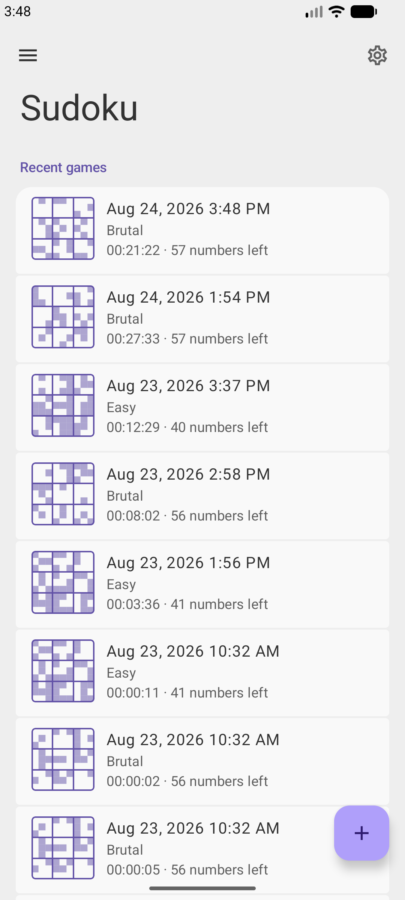
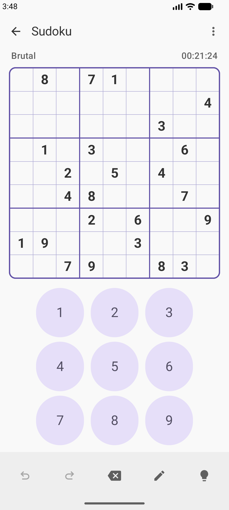
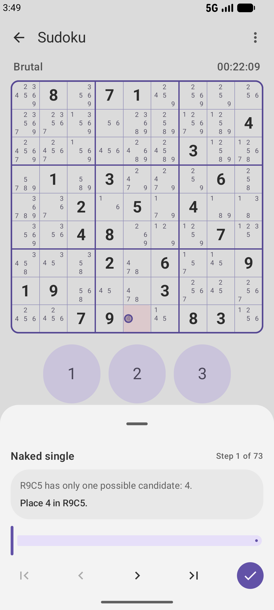
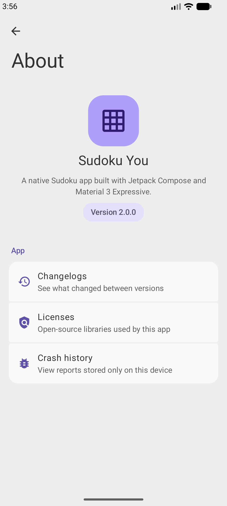

<div align="center">
  

  <h1>Sudoku You</h1>

  <p><strong>Offline Sudoku for thoughtful solving.</strong></p>

  <p>
    A free and open-source Android app with human-style logical hints,
    advanced board tools, flexible import and export, and no tracking.
  </p>

  <p>
    <a href="https://github.com/Galaxy-rio/SudokuYou/releases">
      
    </a>
    <a href="LICENSE">
      
    </a>
    <a href="https://developer.android.com/about/versions/12">
      
    </a>
    <a href="https://kotlinlang.org/">
      
    </a>
    <a href="https://github.com/Galaxy-rio/SudokuYou/stargazers">
      
    </a>
    <a href="https://github.com/Galaxy-rio/SudokuYou/issues">
      
    </a>
  </p>

  <p>
    <a href="https://github.com/Galaxy-rio/SudokuYou/releases"><strong>Download from GitHub Releases</strong></a>
  </p>
</div>

## Features

- **Play offline** — generate classic 9×9 puzzles locally with a unique solution, choose from Easy, Medium, Hard, and Brutal difficulties, or import your own puzzle.
- **Understand every step** — follow human-style logical hints with explanations and board markings, from singles and subsets to fish, wings, coloring, chains, unique rectangles, AIC, and forcing chains.
- **Work your way** — use pencil marks, automatic candidates, undo/redo, restart, and advanced annotations for cells, candidates, frames, and strong or weak links.
- **Keep your progress** — continue automatically saved games, review recent and completed games, and track times and completion statistics by difficulty.
- **Move puzzles freely** — import and export Susser, multiline, pencilmark, Sukaku, Excel/TSV, OpenSudoku, and HoDoKu formats.
- **Make it yours** — customize the Material 3 interface with dynamic colors, custom accents, multiple palettes, light/dark modes, AMOLED black, and board highlighting.
- **Use your language** — switch between English and Simplified Chinese independently from the system language.
- **Stay private** — no network permission, advertising, accounts, analytics, or tracking; crash reports stay local unless you explicitly share them.

Built with Kotlin, Jetpack Compose, Material 3, and Room.

## Screenshots

<p align="center">
  
  
  
  
</p>

<p align="center"><sub>Home and history · Game board · Logical hints · About</sub></p>

## Download

Official builds are available from [GitHub Releases](https://github.com/Galaxy-rio/SudokuYou/releases).

Sudoku You requires Android 12 (API 31) or later.

## Build from source

Prerequisites:

- JDK 17
- Android SDK Platform 37
- Android SDK Build Tools

Linux or macOS:

```shell
./gradlew test lint assembleDebug
```

Windows:

```powershell
.\gradlew.bat test lint assembleDebug
```

Release builds produced directly from this repository are intentionally unsigned. Keep signing keys and credentials outside version control.

## Privacy

Sudoku You does not request Android's `INTERNET` permission and contains no advertising, accounts, analytics, telemetry, or tracking.

Games, settings, statistics, annotations, and crash reports are stored by the app locally. Crash reports are never uploaded automatically. Eligible app data may be handled by Android's system backup according to the device's backup settings.

See the [Privacy Policy](PRIVACY.md) for details.

## Contributing

Bug reports and contributions are welcome. Please read [CONTRIBUTING.md](CONTRIBUTING.md) before submitting a change.

## Acknowledgements

Special thanks to:

- [Open Sudoku](https://gitlab.com/opensudoku/opensudoku) and [Sudoku Coach](https://sudoku.coach/en/learn) for their careful organization and explanations of human-style Sudoku logic and solving techniques.
- [kyoyama-kazusa/Sudoku's Sudoku Tutorial](https://github.com/kyoyama-kazusa/Sudoku/tree/main/docs/tutorial) for making a broad and structured Sudoku tutorial available to the community.

## License

Sudoku You is licensed under the [GNU General Public License v3.0 or later](LICENSE). Third-party notices are listed in [NOTICE](NOTICE).

Copyright © 2026 Galaxy-rio.
