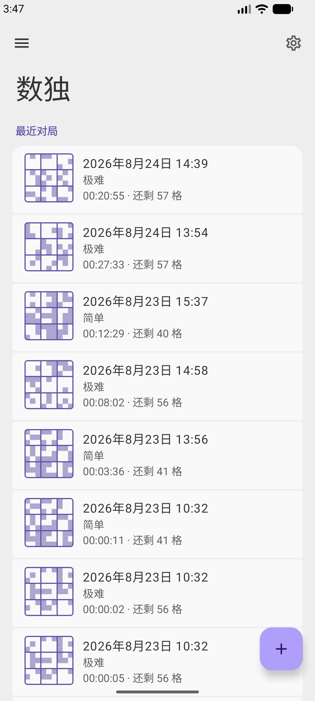
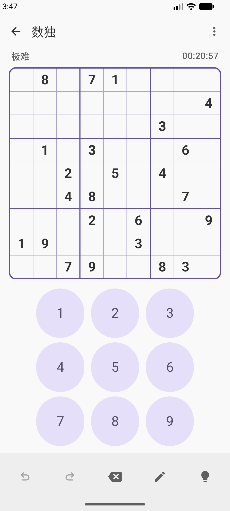
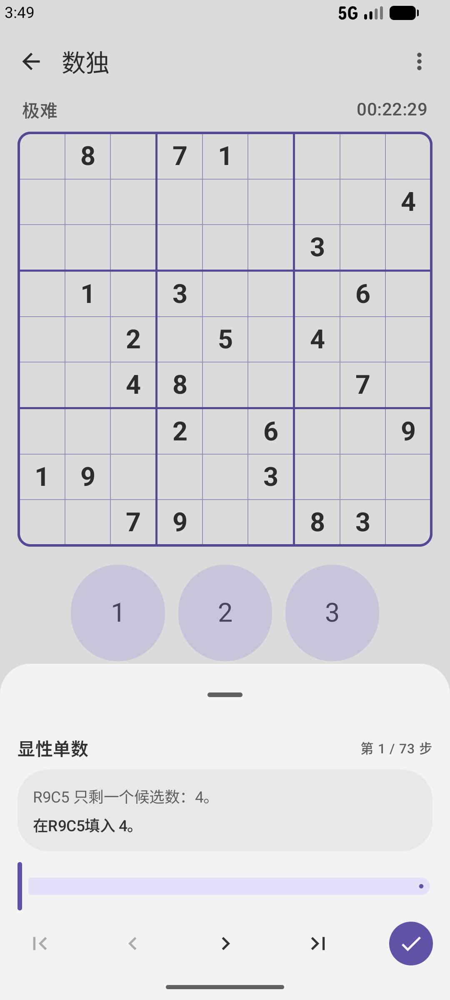
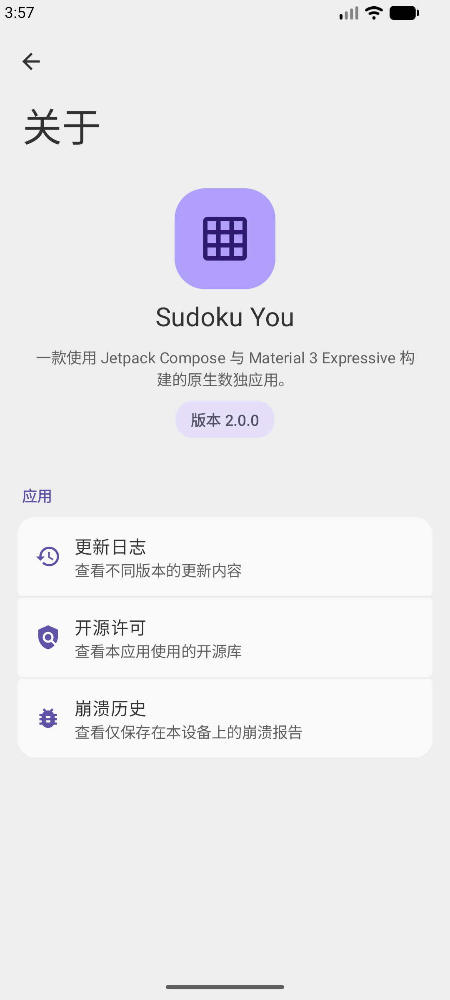

<div align="center">
  

  <h1>Sudoku You</h1>

  <p><a href="README.md">English</a> | 简体中文</p>

  <p><strong>离线数独，专注推理解题。</strong></p>

  <div>
    <a href="https://github.com/Galaxy-rio/SudokuYou/stargazers"></a>
    <a href="https://github.com/Galaxy-rio/SudokuYou/issues"></a>
  </div>

  <div>
    <a href="https://developer.android.com/about/versions/12"></a>
    <a href="https://developer.android.com/studio"></a>
    <a href="https://kotlinlang.org/"></a>
    <a href="LICENSE"></a>
  </div>

  <p>
    <a href="https://github.com/Galaxy-rio/SudokuYou/releases"></a>
    <a href="https://f-droid.org/packages/com.galaxyrio.sudokusolver"></a>
  </p>

一款自由开源的数独应用，提供拟人化逻辑提示、高级盘面工具和灵活的导入导出功能，且无追踪。

</div>

## 功能

- **离线游玩** — 在本地生成具有唯一解的经典 9×9 题目，可选择简单、中等、困难、残酷四种难度，也可以导入自己的题目。
- **理解每一步** — 借助文字说明和盘面标记，跟随拟人化逻辑提示逐步解题，涵盖单数、数集、鱼、翼、染色、链、唯一矩形、AIC 和强制链等技巧。
- **按自己的方式解题** — 使用候选数、自动填充候选数、撤销/重做、重新开始，以及针对格子、候选数、框选和强弱链接的高级标注工具。
- **保留游戏进度** — 继续自动保存的对局，回顾近期和已完成的游戏，并按难度统计用时和完成情况。
- **自由导入导出** — 支持 Susser、多行文本、铅笔候选盘、Sukaku、Excel/TSV、OpenSudoku 和 HoDoKu 格式。
- **打造个性界面** — 使用动态配色、自定义强调色、多种调色板、浅色/深色模式、AMOLED 真黑和盘面高亮选项，自定义 Material 3 界面。
- **选择界面语言** — 支持英语和简体中文，并可独立于系统语言切换。
- **保护隐私** — 无网络权限、广告、账户、分析或追踪；崩溃报告仅保存在本地，除非你主动分享。

使用 Kotlin、Jetpack Compose 和 Material 3 构建。

## 截图

<p align="center">
  
  
  
  
</p>

<p align="center"><sub>主页与历史记录 · 数独盘面 · 逻辑提示 · 关于</sub></p>

## 下载

官方版本可从 [GitHub Releases](https://github.com/Galaxy-rio/SudokuYou/releases) 和 [F-Droid](https://f-droid.org/packages/com.galaxyrio.sudokusolver) 获取。

Sudoku You 需要 Android 12（API 31）或更高版本。

## 从源码构建

前置要求：

- JDK 17
- Android SDK Platform 37
- Android SDK Build Tools

Linux 或 macOS：

```shell
./gradlew test lint assembleDebug
```

Windows：

```powershell
.\gradlew.bat test lint assembleDebug
```

直接从本仓库构建的发布版本默认不签名。请将签名密钥和凭据保存在版本控制之外。

## 隐私

Sudoku You 不申请 Android 的 `INTERNET` 权限，也不包含广告、账户、分析、遥测或追踪功能。

游戏、设置、统计数据、标注和崩溃报告均由应用保存在本地。崩溃报告绝不会自动上传。符合条件的应用数据可能会由 Android 系统根据设备的备份设置进行备份。

详情请参阅[隐私政策](PRIVACY.md)。

## 贡献

欢迎提交问题报告和贡献代码。提交修改前，请先阅读 [CONTRIBUTING.md](CONTRIBUTING.md)。

## 致谢

特别感谢：

- [Open Sudoku](https://gitlab.com/opensudoku/opensudoku) 和 [Sudoku Coach](https://sudoku.coach/en/learn) 对拟人化数独逻辑和解题技巧的细致整理与讲解。
- [kyoyama-kazusa/Sudoku 的数独教程](https://github.com/kyoyama-kazusa/Sudoku/tree/main/docs/tutorial) 为社区提供内容广泛、结构清晰的数独教程。

## 许可证

Sudoku You 采用 [GNU 通用公共许可证 v3.0 或更高版本](LICENSE)。第三方声明见 [NOTICE](NOTICE)。

版权所有 © 2026 Galaxy-rio。
